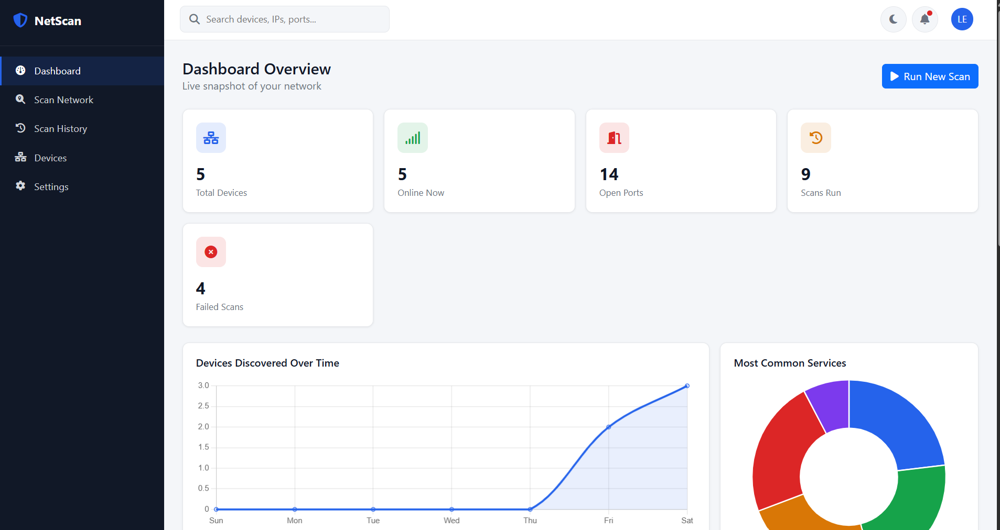
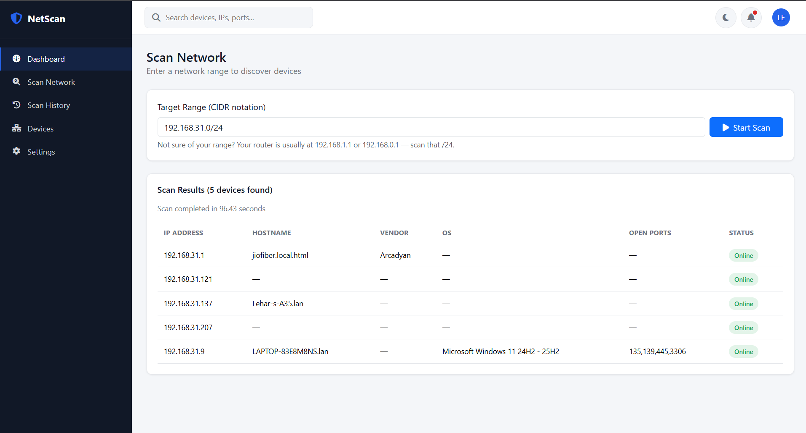
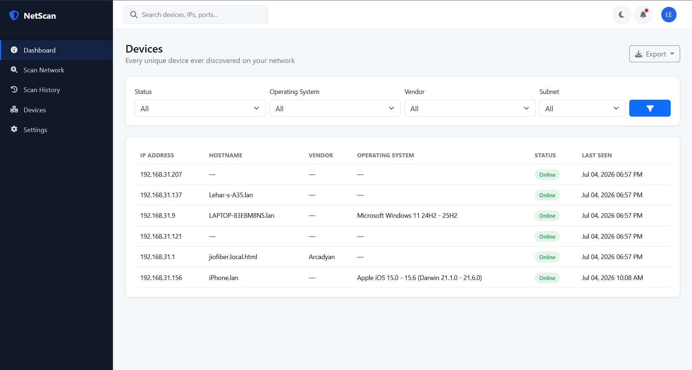
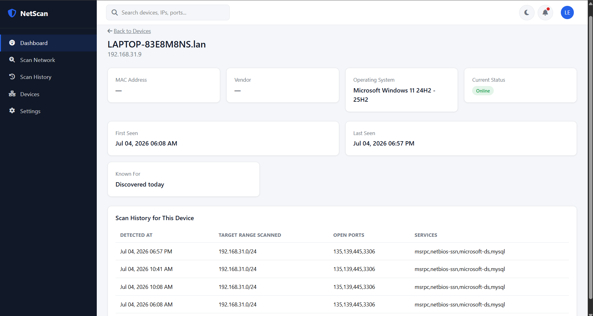
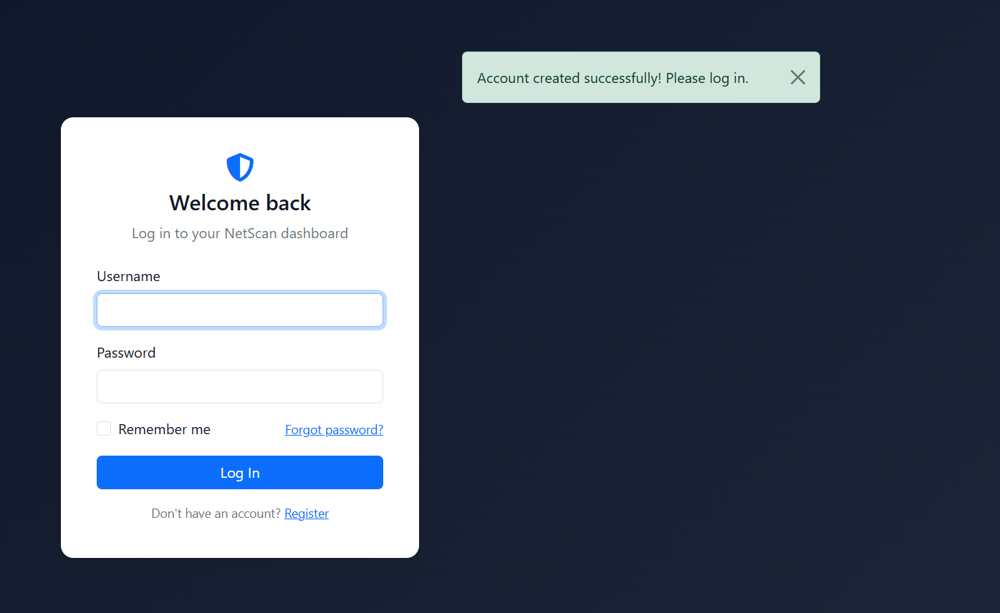
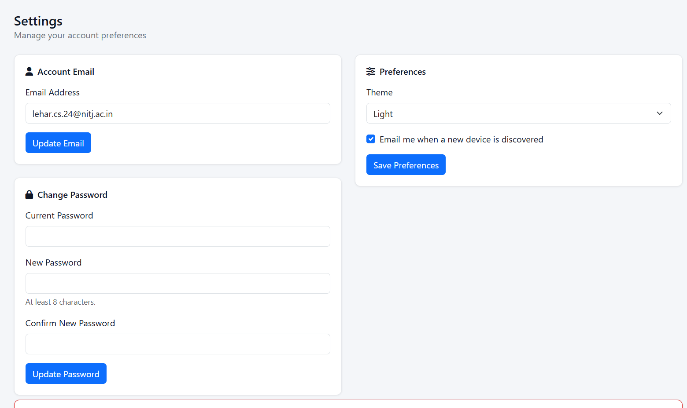

# NetScan Dashboard 🛡️


A full-stack network scanning and monitoring dashboard built with Flask, SQLAlchemy, and Nmap — discover devices on your network, track them over time, and get notified when something new appears.

**[Live Demo](https://netscan-dashboard.onrender.com)** — Note: live scanning requires local network access and is disabled on the cloud demo (see [Deployment Notes](#deployment-notes) below). Clone and run locally to try real scanning on your own network.



## Features

- 🔐 **Authentication** — secure registration/login with hashed passwords, sessions, and "remember me"
- 🔍 **Real Network Scanning** — powered by Nmap, discovers devices, open ports, services, OS, and MAC/vendor info
- 📊 **Live Dashboard** — real-time charts and stats built with Chart.js
- 📜 **Scan History** — searchable, filterable, sortable record of every scan
- 📱 **Device Tracking** — unique device profiles with first/last seen and full scan history per device
- 📧 **Email Alerts** — automatic email notification when a new device joins the network
- 🌓 **Dark Mode** — persisted per-account, not just per-browser
- 🔎 **Global Search** — debounced live search across IP, hostname, vendor, MAC
- 📤 **Data Export** — CSV, JSON, and PDF export of devices and scan history
- 🛡️ **Security** — CSRF protection, rate limiting, input validation, XSS/SQL-injection safe by design

## Screenshots

| Dark mode Dashboard | Scan Network | Devices List | Device Detail | login page | Settings page |
|---|---|---|---|---|---|
|  |  |  |  |  |  |

## Tech Stack

**Backend:** Python, Flask, Flask-SQLAlchemy, Flask-Login, Flask-Mail, Flask-WTF, Flask-Limiter, python-nmap, SQLite
**Frontend:** HTML, CSS, JavaScript, Bootstrap 5, Chart.js, Font Awesome
**Deployment:** Render, Gunicorn, GitHub

## Architecture

Built using Flask's application factory pattern with Blueprints, separating concerns into distinct layers:

```
app/
├── models/       # SQLAlchemy database models (User, Scan, Device, Notification)
├── routes/       # Blueprints — one per feature area (auth, scanner, devices, settings, api)
├── services/      # Business logic layer (Nmap scanning, email sending, file exports)
├── static/         # CSS, JavaScript
└── templates/       # Jinja2 templates
```

This separation keeps routes thin (handling HTTP only) while business logic lives in the service layer — the same pattern used in production backend codebases.

## Database Schema

- **User** → has many **Scans**, **Devices**, **Notifications**
- **Scan** ↔ **Device** — many-to-many via **ScanDevice** (association object pattern), which also stores scan-specific data (open ports, services detected at that point in time)

## Getting Started Locally

```bash
git clone https://github.com/YOUR-USERNAME/network-scanner-dashboard.git
cd network-scanner-dashboard
python -m venv venv
venv\Scripts\Activate.ps1        # Windows PowerShell
pip install -r requirements.txt
```

Copy `.env.example` to `.env` and fill in your own values (Gmail app password for email alerts, etc.):
```bash
cp .env.example .env
```

Run the app:
```bash
python run.py
```
Visit `http://127.0.0.1:5000`.

**Note:** live network scanning requires [Nmap](https://nmap.org/download.html) installed and available on your system PATH, and works best when run with administrator/root privileges (for OS detection).

## Deployment Notes

Network scanning inherently requires direct access to a local network — this mirrors how real enterprise network monitoring tools work (deployed as on-premises agents, not cloud SaaS). The live Render deployment demonstrates the full web application (auth, dashboard, history, exports, UI) but disables the scanning engine itself, since cloud servers have no local network to scan and actively prohibit scanning behavior from their infrastructure.

## Security Highlights

- Passwords hashed with salted, industry-standard hashing (never stored in plaintext)
- CSRF protection on all state-changing requests
- Rate limiting on authentication and scan endpoints
- SQL injection prevented via ORM parameterized queries throughout
- XSS prevented via Jinja2's automatic output escaping
- User-scoped database queries prevent cross-account data access

## License

MIT — see [LICENSE](LICENSE) for details.
